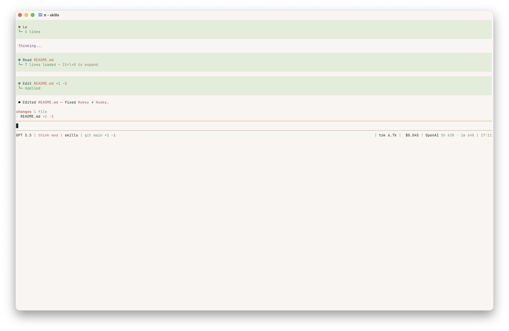
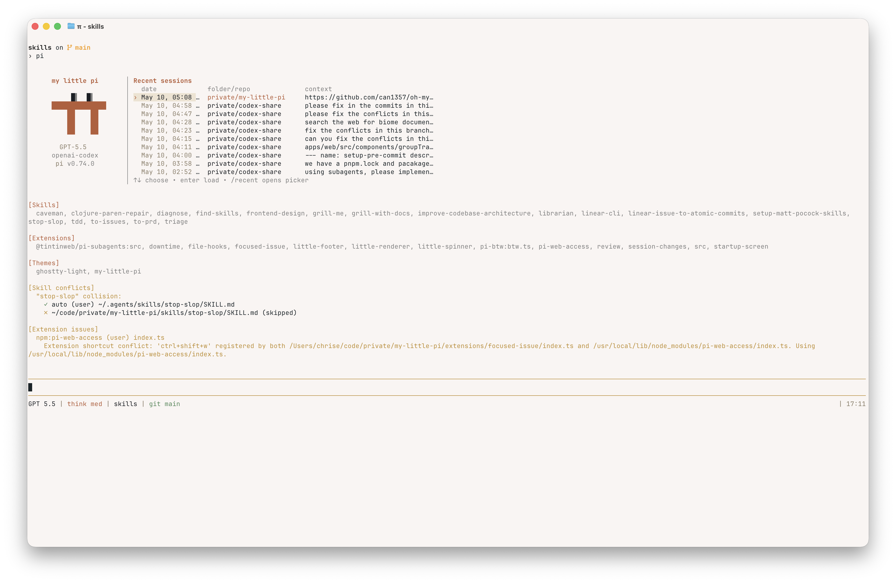
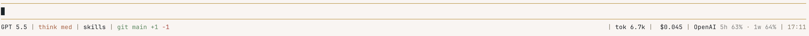
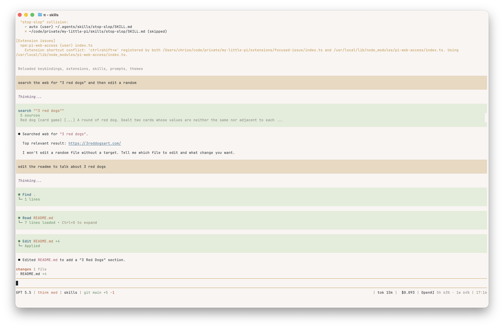
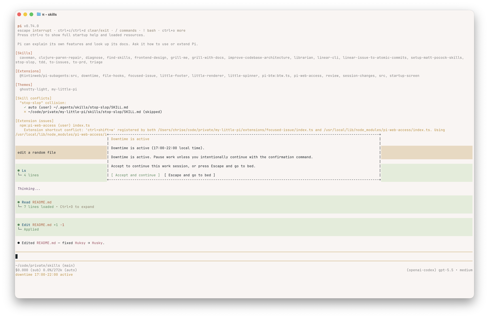

# my-little-pi

Personal package for [Pi](https://pi.dev) extensions, skills, and themes.

## Contents

- `extensions/` - TypeScript or JavaScript Pi extensions.
- `skills/` - Agent Skills packages, each with a `SKILL.md`.
- `themes/` - JSON themes for Pi's terminal UI.

## Install This Package

From this local checkout:

```bash
pi install ./ -l
```

Project-local installs are written to `.pi/settings.json` for the current project. Omit `-l` to install globally in `~/.pi/agent/settings.json`.

From git:

```bash
pi install git:github.com/chrisetheridge/my-little-pi
```

## Try Without Installing

```bash
pi -e ./
```

## Use

- Use the packaged extensions described below after installing or running this package with `pi -e ./`.
- Select the `my-little-pi` theme in `/settings`, or set it manually:

```json
{
  "theme": "my-little-pi"
}
```

## Extensions

### `session-changes`



Shows a small "changes" widget above the editor while Pi is running.
It tracks successful `edit` and `write` tool results, then displays the most recently changed files with approximate `+added` / `-deleted` line counts and repeat-touch counts.

### `startup-screen`



Replaces Pi's default startup header with a recent-session launcher.
It lists the last 10 sessions across all projects with:

- modified date/time
- folder/repo name
- session title, using the explicit session name when available and falling back to the first user message

When the editor is empty, use `↑` / `↓` to move through the list and `Enter` to load the selected session.
Typing normally ignores the launcher. You can also run `/recent` to open an interactive picker, or `/recent <index>` to load a numbered recent session directly.

### `little-footer`



Adds a custom minimal footer, including OpenAI usage window tracking and git status.

### `little-renderer`



Replaces Pi's default message/tool rendering with a denser, quieter layout.
Assistant prose is rendered as dotted paragraphs (`●`), thinking blocks are dim/italic and marked with `✽`, and smaller Markdown headings are flattened so long sessions scan more like a readable transcript than a stack of cards.

It also re-registers the built-in file and shell tools with compact call/result renderers:

- `read`, `grep`, `find`, `ls`, `write`, and `edit` show one-line headers with the target path or search pattern.
- `bash` shows the command, timeout when present, and a short done/exit summary.
- Running tools blink while pending, then settle to success/error dots.
- Collapsed results show counts and status; expanded results show previews or, for `edit`, the rendered diff and `+added` / `-deleted` counts.

### `downtime`



Adds a configurable rest-window guard for late-night sessions. During the active window it shows a footer status, injects a small downtime policy into the agent context, and prompts with an overlay before agent/tool work continues. Accepting the overlay confirms continuation for the current downtime window; pressing Escape blocks tool execution and nudges you to stop.

Defaults:

```json
{
  "time": "22:00",
  "durationMinutes": 480,
  "confirmCommand": "echo continue-downtime",
  "message": "Downtime is active. Pause work unless you intentionally continue with the confirmation command.",
  "statusLabel": "downtime"
}
```

Configuration is loaded from `~/.pi/agent/extensions/downtime.json`, then overridden by project-local `.pi/extensions/downtime.json`. You can also override just the start time for a run with Pi's `downtime` flag in `HH:MM` local time format.

Useful commands:

- `/downtime` or `/downtime status` shows the current window, confirmation state, command, and config source.
- `/downtime confirm` confirms continuation for the active window.
- Running the configured confirmation command in `bash` also confirms the window.

## Develop

Install dependencies for editor types and local checks:

```bash
pnpm install
```

Run checks:

```bash
pnpm run check
pnpm run test
pnpm run pack:dry-run
```

Run the standard full verification sequence:

```bash
pnpm run ci
```

Reload Pi resources after edits:

```text
/reload
```

Themes hot-reload when the active theme file changes.

## Package Manifest

`package.json` exposes all resources through:

```json
{
  "pi": {
    "extensions": [
      "./extensions/downtime/index.ts",
      "./extensions/little-footer/index.ts",
      "./extensions/little-renderer/index.ts",
      "./extensions/review/index.ts",
      "./extensions/little-spinner/index.ts",
      "./extensions/focused-issue/index.ts",
      "./extensions/session-changes/index.ts",
      "./extensions/startup-screen/index.ts"
    ],
    "skills": ["./skills"],
    "themes": ["./themes"]
  }
}
```

## References

- [Pi packages](https://github.com/badlogic/pi-mono/blob/main/packages/coding-agent/docs/packages.md)
- [Pi extensions](https://github.com/badlogic/pi-mono/blob/main/packages/coding-agent/docs/extensions.md)
- [Pi skills](https://contextqmd.com/libraries/pi-mono/versions/0.61.0/pages/packages/coding-agent/docs/skills)
- [Pi themes](https://mintlify.wiki/badlogic/pi-mono/coding-agent/themes)
